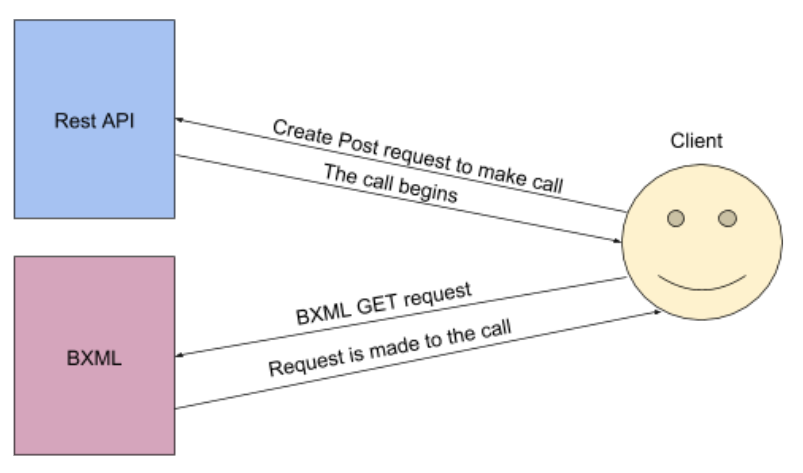
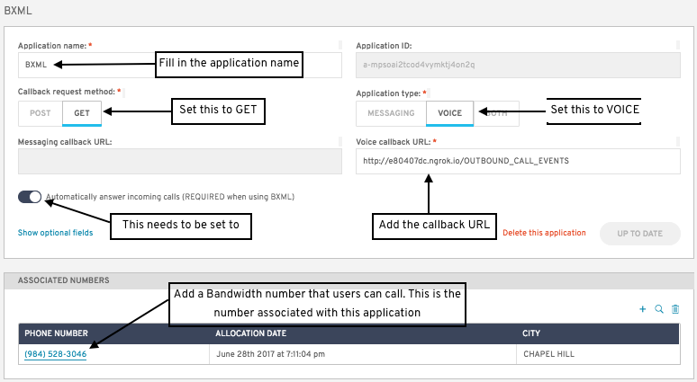

# BXML Overview

## Overview

Bandwidth XML (BXML) is a much simpler way to interact with a call. Rather than working with callbacks, BXML handles the call state for you so all you have to implement is the order of events. BXML has many built in features and is perfect for quick development.

## Assumptions

* You have a way to receive webhooks.
* You have downloaded [Postman](https://www.getpostman.com) or have another way to make Post requests to the API.
* You have your [Voice and Messaging API](https://app.bandwidth.com) {userId}, {apiToken}, {apiSecret}. For more information about finding your credentials, visit the [Getting Started Setup Guide](https://dev.bandwidth.com/getStartedSetupGuide.html) under "Step 3. Get Your Bandwidth API User ID, Token, and Secret".
* You have a [Bandwidth phone number](https://dev.bandwidth.com/howto/phonenumbers.html).

## About BXML

BXML is completely separate from the REST API. When using the BXML, the REST API can only be used to make calls. Here is an example of a common call flow:


## Setup

For a step by step guide on downloading the software and adding your Bandwidth credentials, visit the [Get Started](https://dev.bandwidth.com/get-started.html)

## Create Call

To create the call, we will use Bandwidth’s REST API. **THIS IS THE ONLY TIME WE WILL USE THE REST API IN THIS APPLICATION**. Create a call with the `to`, `from`, `callbackUrl`, and `callbackHttpMethod` parameters. The `callbackHttpMethod` needs to be set to `GET` for BXML. The `callbackUrl` is also important because this is how Bandwidth will notify your program that the call has started and your program can then send the BXML information to the call. For a step by step guide on creating the call, reference the [Get Started Guide](https://dev.bandwidth.com/get-started.html) or for a quick overview, visit the [Outbound Call Building Block](https://dev.bandwidth.com/howto/outboundCall.html).

```http
POST https://api.catapult.inetwork.com/v1/users/{{userId}}/calls HTTP/1.1
Content-Type: application/json; charset=utf-8
Authorization: {apiToken:apiSecret}

{
	"to"                 : "+12345678902",
	"from"               : "+12345678901",
	"callbackUrl"        : "{callbackUrl}",
	"callbackHttpMethod" : "GET"
}
```

## Handle Incoming Calls
**Make sure auto answer is on**
### Using the Voice and Messaging Dashboard

To allow the program to answer incoming calls, login to the [app.bandwidth.com](https://app.bandwidth.com) dashboard. Either create a new [application](https://app.bandwidth.com/applications/manage/) or edit an existing [application](https://app.bandwidth.com/applications/manage/). The callback request method should be `GET` and the application type should be set to Voice. Add a callback URL and toggle “Automatically answer incoming calls” to on. Finally, add a Bandwidth phone number to this application. This number will be the number users can call. When the user calls the bandwidth number, the number will answer and notify the callback url that there is an active call. From there, the program acts the same way as create call.



### Using the REST API

To answer an incoming call using the REST API, visit the full REST API documentation [here](../methods/calls/postCallsCallId.md).

## Implementing BXML

The call must be active in order to send BXML. BXML has the ability to do the following:

* [Play Audio](verbs/playAudio.md): play a .mp3 or .wav audio file into a call
* [Speak Sentence](verbs/speakSentence.md): Speak any sentence into the call
* [Gather](verbs/gather.md):  Collects digits from the user. This would be used in a call tree (ex. Press 1 for more options press)
* [Record](verbs/record.md): Record the user. This is often used for voicemail
* [Redirect](verbs/redirect.md): Directs the program from one block of code to another
* [Transfer](verbs/transfer.md): Transfer call from one number to another
* [Hangup](verbs/hangup.md): Ends the call
* [Pause](verbs/pause.md): Pauses the execution of the current BXML document
* [SendDtmf](verbs/sendDtmf.md): Send DTMF digits to a call
