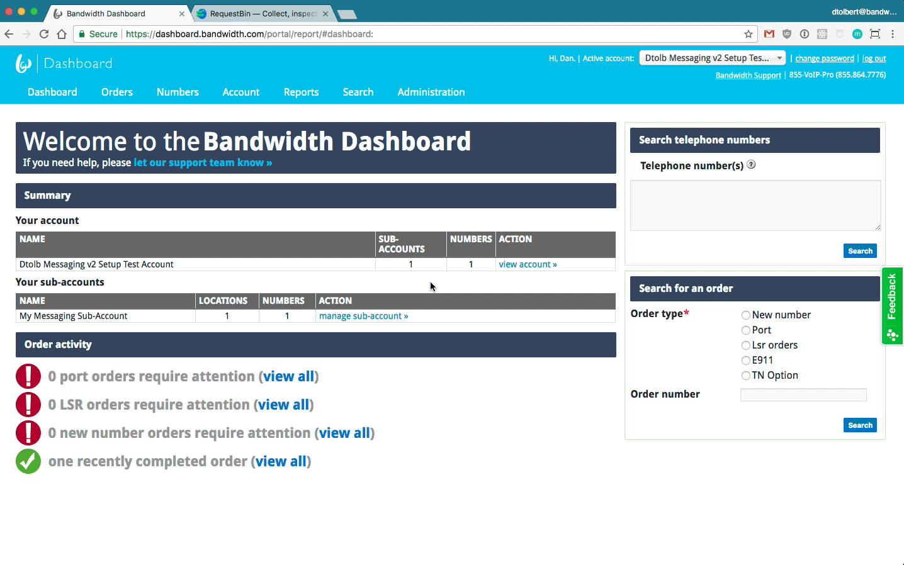
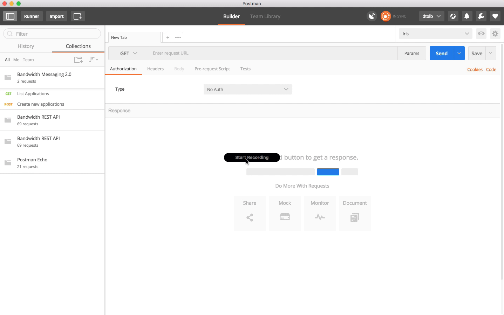
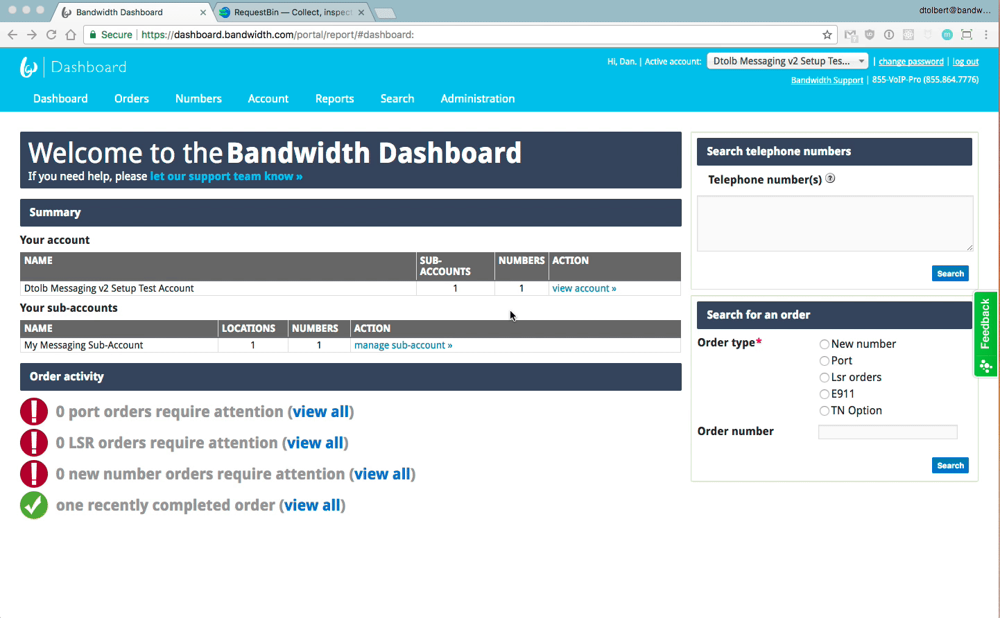
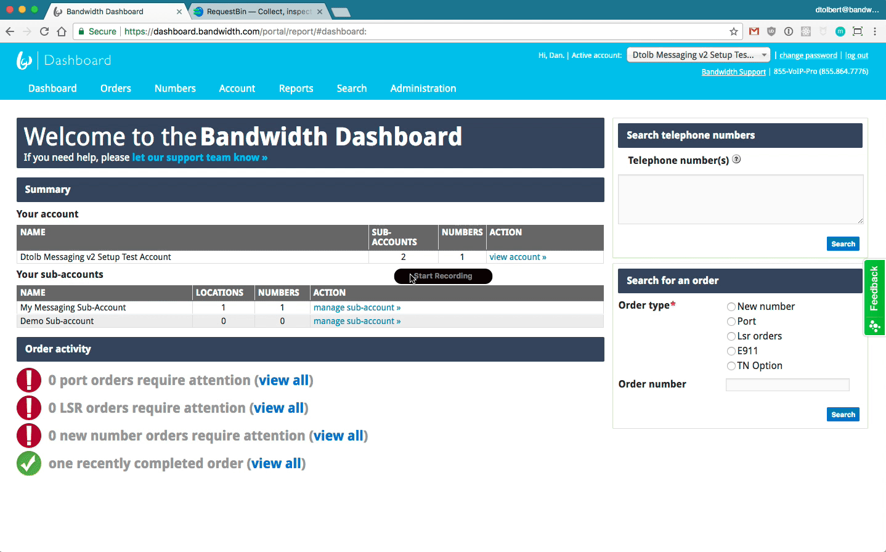
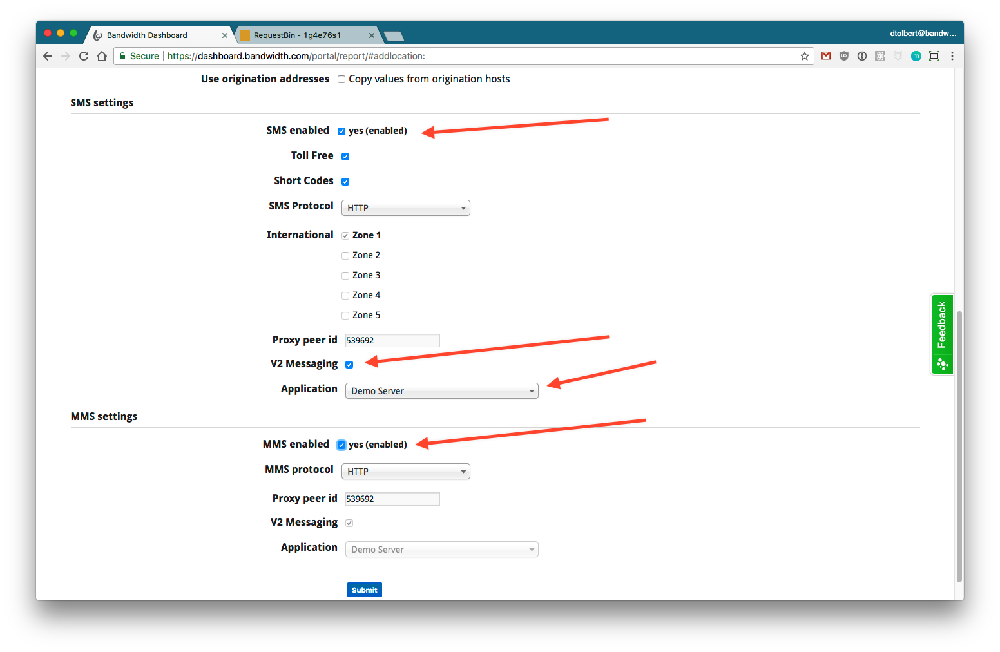
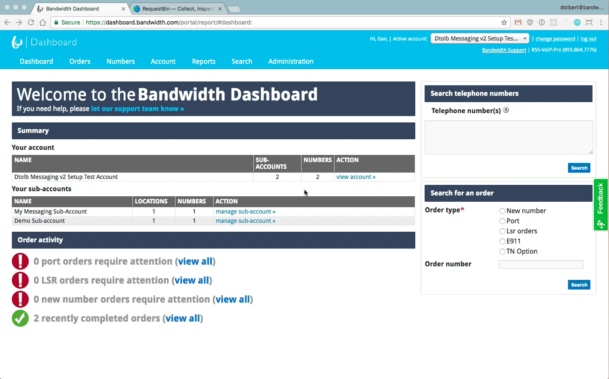




# Bandwidth Messaging 2.0 UI Setup

## About
The Messaging 2.0 API is an all new way to send and receive SMS, MMS, and Group Messages on the Bandwidth network. It works with your numbers you already have in the Number Management section of the Bandwidth Phone Number Dashboard.

⚠️ Messaging 2.0 Does not store **ANY** messages or records for fetching later. If you need message history you need to implement a storage solution that meets your needs. ⚠️

### Contact  your [CSA](http://support.bandwidth.com) to get your intial setup.

* Creating Bandwidth Phone Number Dashboard (AKA: Dashboard, Iris) login and account
* Modifying account to enable HTTP Messaging
* Modifying account to point to correct Proxy ID
* Linking Bandwidth Voice and Messaging APIs (AKA Catapult, Application Platform) userid to Bandwidth Phone Number Dashboard (AKA: Dashboard, Iris) account

---

## Getting Started

1. [Get your account ID](#get-your-account-id)
2. [Setup your Application](#setup-your-application)
3. [Create subaccount (_site_)](#create-subaccount-site)
4. [Create location (_sippeer_) and assign the application](#create-location-sippeer-and-assign-the-application)
5. [Order Phone numbers to location (_sippeer_)](#order-numbers-to-location)
6. [Sending Messages](#sending-messages)
7. [Video Walk through](#video-walk-through)

### Get your account ID
<a name="get-your-account-id"></a>



### Setup your Application
<a name="setup-your-application"></a>

The Application contains the HTTP URL you want to use for both inbound and outbound messages.

* To get started, you'll want to head over to the [Bandwidth Phone Number Dashboard](https://dashboard.bandwidth.com/portal/report/) and set up an Application on your Location (SipPeer) that you want to use for HTTP Messaging. You'll get an `applicationId` for the Application you created, which will be used when sending messages.



#### Application Parameters



| Parameters      | Mandatory | Description                                                                        |
|:----------------|:----------|:-----------------------------------------------------------------------------------|
| `AppName`       | Yes       | Plain text name of the application                                                 |
| `CallbackUrl`   | Yes       | Url to recieve _all_ [message events](./events/msgDelivered.md)                    |
| `CallBackCreds` | No        | Basic auth credentials to apply to your [message events](./events/msgDelivered.md) |



### Create Application



```http
POST https://dashboard.bandwidth.com/api/accounts/{{accountId}}/applications HTTP/1.1
Content-Type: application/xml; charset=utf-8
Authorization: {user:password}

<Application>
    <AppName>Demo Server</AppName>
    <CallbackUrl>https://requestb.in/zuaqjbzu</CallbackUrl>
    <CallbackCreds/>
</Application>
```



### Response

* Status: 201
* Content-Type: "application/xml"

```xml
<?xml version="1.0" encoding="UTF-8" standalone="yes"?>
<ApplicationProvisioningResponse>
    <Application>
        <ApplicationId>7cc3c4f7-3b8f-4fff-a211-45070792b431</ApplicationId>
        <ServiceType>Messaging-V2</ServiceType>
        <AppName>Demo Server</AppName>
        <CallbackUrl>https://requestb.in/1m009f61</CallbackUrl>
        <CallbackCreds/>
    </Application>
</ApplicationProvisioningResponse>
```



---

### Create subaccount (_site_)
<a name="create-subaccount-site"></a>

* You'll need a sub-account (_site_) in order to create a location (_sippeer_).
* Fill in the address and set the `type` to `Service`



---

### Create location (_sippeer_) and assign the application
<a name="create-location-sippeer-and-assign-the-application"></a>

* You'll need a location (_sippeer_) in order to group phone numbers.
* When creating the location be sure to check:
	* `SMS Enabled`
	* `Toll Free` (if available)
	* `Short Code` (if available)
	* `V2 Messaging`
	* `Application` - Select the application created above
* If you need `Toll Free` or `Short Code` support contact [support](http://support.bandwidth.com) to enable.



#### More Detail


---

### Order Phone numbers to location (_sippeer_)
<a name="order-numbers-to-location"></a>

* Once your application, sub-account (_site_), and location (_sippeer_) have been configured you're ready to start ordering phone numbers to use.
* Using the UI, search for a number and order it to the sub-account (_site_) and location (_sippeer_) created above.



---

### Sending Messages

<a name="sending-messages"></a>

* To send a message, `POST` to the [`/messages` endpoint](methods/createSingle.md)
* In the V2 Messaging API, messages are sent asynchronously. Message validation will happen after the server returns `202`. API clients should listen for HTTP callback events if they need to track message state after the initial `POST` request.


#### Message Parameters



| Parameter       | Mandatory | Description                                                                                              |
|:----------------|:----------|:---------------------------------------------------------------------------------------------------------|
| `from`          | Yes       | One of your telephone numbers the message should come from (must be in E.164 format, like +19195551212). |
| `to`            | Yes       | The phone number the message should be sent to (must be in E.164 format, like `+19195551212`).           |
| `text`          | Yes       | The contents of the text message (must be 2048 characters or less).                                      |
| `applicationId` | Yes       | The ID of the Application your `from` number is associated with in the Bandwidth Phone Number Dashboard. |



### Send Text Message



```http
POST https://api.catapult.inetwork.com/v2/users/{{userId}}/messages HTTP/1.1
Content-Type: application/json; charset=utf-8
Authorization: {token:secret}

{
  "from"          : "{{your-bandwidth-number}}",
  "to"            : "{{yourTN}}",
  "text"          : "Good morning, this is a test message",
  "applicationId" : "{{your-application-id}}"
}
```



### Response

```http
HTTP/1.1 202
Content-Type: "application/json;charset=UTF-8"

{
    "id"            : "15047516192013g5tuga77zsa6jrp",
    "owner"         : "+19193529968",
    "applicationId" : "05851417-c78b-4636-81a2-014a54d8f119",
    "time"          : "2017-09-07T02:33:39.201Z",
    "direction"     : "out",
    "to"            : ["+19191231234"],
    "from"          : "+19193524444",
    "text"          : "Hi from Bandwidth!"
}
```




### Video Walk through
<a name="video-walk-through"></a>


<iframe width="700" height="395" src="https://www.youtube.com/embed/ZMAz2UaZeVg" frameborder="0" allowfullscreen></iframe>


#### Callbacks and Delivery Receipts
* Callbacks will be sent to the Callback URL for the Application associated with the `from` number on the outgoing message.
* You will get a callback for any event related to that message. For example, you will get an HTTP callback if your message was sent, delivered, or blocked. In addition, you will get an event for any kind of Delivery Receipt that the destination carrier sends back, regarding the delivery of your message.
* For incoming messages sent to your numbers, a callback will also be received, notifying your Application of the incoming message. For group messages where you own multiple recipient phone numbers, you will receive a distinct event and `messageId` for each individual recipient.

#### Tags
* If there is a need to identify individual outbound messages, or correlate them with an ID in your own application, the `tag` field can be set to any string. The custom `tag` will be included in all callbacks for an outbound message.

#### API Credentials
* API Credentials work the same way they do in the V1 Messaging API. Use your API Token and Secret with Basic Auth when making API requests to send messages. [See here for more details](http://dev.bandwidth.com/security.html).
